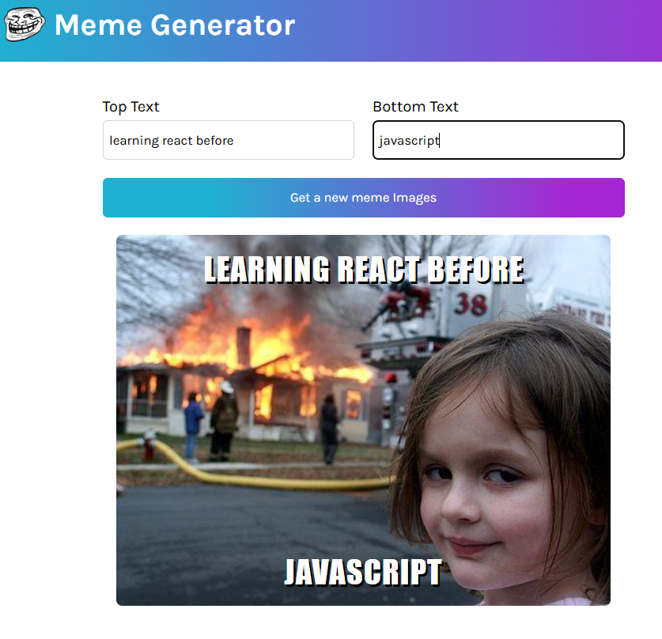

# Meme Generator 🎭 

A fun Meme Generator built with **React**! This app lets you enter **top and bottom text**, and it fetches a **random meme image** from an API.  

## 🖼️ Preview  

Here are some memes generated using the app:  

  
  

## 🎓 What I Learned  

- Handling **controlled components** in React  
- Fetching and managing API data with **useEffect**  
- Functional programming concepts in React  
- Managing component state with **useState**  

## 💡 Acknowledgments  

A **huge thanks to me** (because who else wants to learn web dev? haha 😆) and of course to **Scrimba** & **Bob Ziroll** for the amazing guidance!  

---

Would love to hear your feedback! Try the app and share your funniest memes! 😃🚀  
